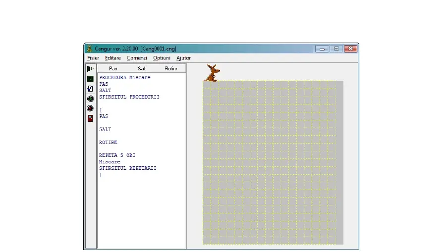

### Create games in javascript
- [Snake Game](https://www.youtube.com/watch?v=AaGK-fj-BAM&t=2s&ab_channel=TheCodingTrain)
- [Game-Dev BitBucket](https://bitbucket.org/Schedule93/games-dev/src/master/)
- [Cyber Forum - Поле чюдес : JS](https://www.cyberforum.ru/javascript/thread1426193.html)
- [Rock, scissor, papper](https://codepen.io/cliff538/pen/aHxfr)
- [Gues the number](GUES_NUMBER.md)

### Future Tasks:
- Scrie o programă în browser analogic cu `Canguourou` [Link 1](https://sites.google.com/view/onlinecursuri/INFORMATICA/clasa-a-viii-a/semestrul-ii-8/no%C8%9Biune-de-algoritm) și [Link 2](https://www.scribd.com/presentation/427414121/Executantul-Cangourou) Uite-te la poză. 
- Arată în consolă cîte numere sa găsit comune în 2 arr. ?
- Arată în consolă doar elementul care nu se repetă. `var arr = [1,1,8,8,2,2,4,4,3,3,5,9,9];` Mai bine spus numărul 5 din varibila arr.
- [Как проверить гласные в JavaScript?](https://fooobar.com/questions/367622/how-do-i-check-for-vowels-in-javascript)
- [Code review](https://codereview.stackexchange.com/questions/128121/count-the-number-of-vowels-and-consonants/128127)
- [Three ways to repeat a string in JavaScript
](https://www.freecodecamp.org/news/three-ways-to-repeat-a-string-in-javascript-2a9053b93a2d/)
- [Count the number of occurrences of a specific character in a string](http://www.codecodex.com/wiki/index.php?title=Count_the_number_of_occurrences_of_a_specific_character_in_a_string#JavaScript)
- [How to Count the Number of Properties of the JavaScript Object](https://dzone.com/articles/how-to-count-the-number-of-properties-of-the-javas)
- [Double Consonant - GitHub](double_consonant.md)
- [Следим за курсором. Делаем живые глаза](https://www.youtube.com/watch?v=Sftw1qKo_n0&list=PLQqEY2kzSbZ7nLB8fooOpq89XfuMmwtMW&index=19&t=631s)
- [] Frequent question [Stack Overflow](https://stackoverflow.com/questions/tagged/javascript?sort=frequent) from JavaScript 
- [] Test : Who are you from anime Naruto :)
- [] Check if first letter is `lowerCase` or `UpperCase`.
- [] De fiecare data cand porneshti consola sa se maraeasca numarul (n += 1)
- [] Algorithm bubble sort.
- [] See in in file `scripts/check_letter.js` and align all errors.
- [] Check if exsist in array a object.
- [] Work with data `Moment.js`
- [] Write a program minutes and seconds in js but he(it) will be counting all seconds together with minutes. Learn [here](https://stackoverflow.com/questions/3552461/how-to-format-a-javascript-date)
- [] Fibonaci. Take example from the book js.
- [] if is undefined write something else
- [] Work with table [View CodePen](https://codepen.io/keukenrolletje/pen/GooXrQ)
- [] Создать массив заданной длины
- [] If the symbols `{}, [], ()` are equal true else false
- [] In partea stanga ai un bloc cu 7 poze mici cand dai pe fiecare poza, cu cursorul sa se schimbe poza + zoom + download a image.
- [x] Sa vezi cîte argumente sunt într-o funcție. [see here](https://overcoder.net/q/2569/%D0%BA%D0%B0%D0%BA-%D0%BE%D0%B1%D1%8A%D0%B5%D0%B4%D0%B8%D0%BD%D0%B8%D1%82%D1%8C-%D0%B4%D0%B2%D0%B0-%D0%BC%D0%B0%D1%81%D1%81%D0%B8%D0%B2%D0%B0-%D0%B2-javascript-%D0%B8-%D0%B4%D0%B5%D0%B4%D1%83%D0%BF%D0%BB%D0%B8%D1%86%D0%B8%D1%80%D0%BE%D0%B2%D0%B0%D1%82%D1%8C-%D1%8D%D0%BB%D0%B5%D0%BC%D0%B5%D0%BD%D1%82%D1%8B) Exemplu:
- Удалённое управление компьютером
- TRELLO

```javascript
function count_arguments(arg1, arg2, arg3, arg4, arg5) {
  data = arguments.length;
  for (var i = 0; i < data; i++) {
    console.log(i);
  }
}

count_arguments("room", "such", "zoo");
```

- [] reverse smile

```js
function reverse_smile() {
	String.prototype.reverse = function() {
	let textArray = [...this];
	let reverseString = "";

	for (let i = 0; i < textArray.length; i++) {
		let char = textArray[i];
		while (textArray[i + 1] === '\u200d') {
			char += textArray[i + 1] + textArray[i + 2];
      		i = i + 2;
    	}
    	
    	reverseString = char + reverseString;
  }
  
  return reverseString;
}

const text = "Hello world👩‍🦰👩‍👩‍👦‍👦";

console.log(text.reverse());

//Fun fact, you can chain them to dubbel reverse :)
//console.log(text.reverse().reverse());
}
```

- [] Treb sa fac un program care am ca argument 3 argumente, x, y, z. Cate combinatii pot sa fac cu ele ? Dar daca in loc de 3 argumente punem o litera care va insemna cat de multe argumente va fii si atentie va calcula iarasi cate combinatii va fii.
- [] How many words are in argument. But in a sentence or comma? 
Pentru fiecare element din argument
- [] Calculează cîte vocale sunt intr-un cuvînt/arg
- [] Factorial
- [] Create a program which you will can make difference between a real word and symbols which does not exist in real world. Exemple. `ssdfsdfa`. This is not a word but `travel` is a word.
- [] Cum din multe masive să faci un masiv intreg ? Exemple :
- [] Ai un array. FIe `var arr = [2,4,2,1,5,7,6,9,8,0];`. Si la fiecare iteratie sati dea un masiv random din aceste numere. Adica din toate aceste 10 elemente * la 10 iteratii. Undeva o sa ai matinca 100 de variante. Ah da mai inainte de toate incera ceva de gen:

* Asta e important. Nu sterge ci rezolva in js.

```py
def shuffle(a):
    n = len(a)
    for i in range(n - 1):  # i from 0 to n-2, inclusive.
        j = random.randrange(i, n)  # j from i to n-1, inclusive.
        a[i], a[j] = a[j], a[i]  # swap a[i] and a[j].
```

- To generate a milion names and last names for database Postgres like example. Și de aici să faci diferite manipulări de exemplu sortarea tuturor utilizatorilor care au proprietateea - locuesc in Moldova. Cu alte cuvinte fiecare utilizator sa aiba proprietati, dar asta e deja alta programa adaugatoare. Example:

```js
// și așa să fie la fiecare utilizator
var user_37234 = {
  id: 37234,
  name: "Nicolai Cushnir",
  gender: "male",
  age: 28,
  country: "Moldova",
  posts: 0,
  comments: 0,
  last_vizited: "1 hour ago",
  rank: "junior" 
}
```

Dar toată lista cu generarea utilziatorilor să arate așa :

```js
Dion Dupont
Rohaan Berg
Riya Poole
Eli Petty
Wasim Yoder
Muna Leblanc
Farhan Mcguire
Carolyn Lozano
Scarlett Sandoval
Renzo Ferreira
Monty Wolfe
Eshaan Glover
Aida Price
Zachariah Drake
Krista Wilkerson
Tayah Holden
Alara Sutton
Felix Mcleod
Sonia Whittaker
Misha Bowes
Kaison Plummer
Hafsa Monaghan
Azra Mcneil
Avneet Larson
Dalton Potts
Yousef Vo
Saima Dougherty
Aubree Macfarlane
Brook Irwin
Dina Macdonald
Ira Gonzales
Maxime Cowan
Brian Whelan
Hayleigh Anderson
Amelia-Rose Greaves
Geraldine Watts
Cristina Thompson
Tamera Escobar
Safah Shepherd
Allana Neale
Martyn Browne
Darrel Riddle
Rhiana Hinton
Stevie Mayo
Callie Chapman
Allison England
Umair Santana
Zackary Macgregor
Jacques Healy
Madelaine Harrison
Melina Pearce
Isaiah Dodson
Mohammed Russell
Landon Mair
Jarod Dejesus
Nafeesa Redman
Arif Parsons
Fynn Butler
Angelika Browne
Matylda Hayes
Will Smith
```
- Как сделать расширение для браузера? Тика как `Ad Block`, `Alexa Trafic Rank`, `Build width Technology`
- See what type of data is :

```Algorithm
check type of data:
* number
* string
  1. "2"
  2. 
* undefined
  * emty field
  * "" || '' || " " || ' ' ;
* nall
* object
* array
* symbols : 
  {<>=-!.,* **() {} }
```

- Să fac o programă ceva de gen sa scriu în consolă sau terminal `run program` de exemplu, și o să-mi apară pe rînd fiecare programă pe care am făcut cu ajutorul la js. În plus de fiecare cînd o să pornesc progrma să apară în forma `random` cît și prima atît și următoarele pînă la sfîrșit cu așa scop să nu se repete nici una din ele. Probabil o sa am un array cu mai multe array-uri in el. Treb de gindit ...

### Not Important. It's for me.

* [Emoji](https://gist.github.com/AliMD/3344523)
* [Basic writing and formatting syntax
](https://help.github.com/en/articles/basic-writing-and-formatting-syntax)
* [Codepen](https://codepen.io/)
* [Regular Expression](https://regex101.com/)
